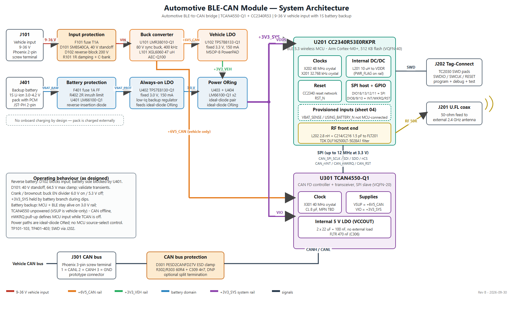

# Automotive BLE-CAN Module Architecture

**Revision C | 2026-09-30**

This document describes the current KiCad design in `hardware/BLE-CAN-module.kicad_sch`. It covers the vehicle input and battery backup power paths, CC2340R53 BLE controller, TCAN4550 CAN interface, and their external connections. It is a design description, not a vehicle-transient qualification report.

## System overview

The module accepts a nominal 9-36 V vehicle supply and a separately charged 1-cell Li-ion battery. The protected vehicle input is converted to `+6V5_CAN` for the CAN transceiver and regulated to `+3V3_VEH`. The battery branch produces a protected battery node and a low-quiescent-current 3.0 V rail.

U403/U404 (LM66100-Q1) implement the dual ideal-diode ORing topology of the LM66100-Q1 datasheet, section 9.2.1: each device's CE pin is cross-coupled to the opposite source (`U403 CE` = `+3V3_VEH`, `U404 CE` = `+3V0_BAT`), so the comparators select the higher rail with make-before-break behavior and block reverse current in both directions without any control logic. Because the vehicle rail is regulated to 3.3 V and the battery rail to 3.0 V, source priority is deterministic by construction: the vehicle path conducts whenever vehicle power is present, and the battery path takes over automatically when `+3V3_VEH` decays to about 80 mV below `+3V0_BAT`. The 0.3 V offset also avoids the datasheet-documented corner in which two equal input rails leave both ORing devices off. This is an analog priority scheme; there is deliberately no firmware in the changeover path.

The CC2340R53 runs the BLE application and communicates with the TCAN4550 over SPI. The CAN transceiver is powered from `+6V5_CAN` and uses `+3V3_SYS` for its digital I/O. Consequently, battery backup can keep the MCU domain alive while the vehicle-only CAN transceiver is unpowered; CAN communication is then unavailable.

## Power input and backup

### Vehicle input

J101 is the 2-pin 9-36 V input. F101 (T1A) and the input-protection network, including D101 (Vishay SM8S40CA TVS) and D102 (PNE20010ER-Q reverse-polarity protection), protect the downstream converter. R101 (1 ohm) and the input capacitor bank provide damping/filtering. U101 (LMR38010-Q1) with L101 (47 uH) generates `+6V5_CAN`; U102 (TPS7B8133-Q1) regulates that rail to `+3V3_VEH`. D101's 40 V rating is its reverse standoff voltage, not its clamp voltage; its specified maximum clamping voltage is 64.5 V at the rated pulse current. This alone does not establish compliance with a vehicle load-dump or other transient profile.

The 6.5 V intermediate rail is chosen against the TCAN4550 supply window: VSUP recommended operating range is 6-24 V with UVSUP thresholds of 5.5-5.9 V rising and 4.5-4.7 V falling, so 6.5 V provides headroom above UVSUP while minimizing dissipation in the transceiver's internal 5 V LDO and in U102.

### Battery backup

J401 accepts a protected 1-cell Li-ion pack (3.0-4.2 V); the pack is charged externally and no charger is present on this board. F401, R402, and U401 (LM66100-Q1) provide battery-branch protection; U401 uses the datasheet's always-on reverse-current-blocking configuration (CE tied to VOUT through R401), so the pack is isolated from any downstream fault that could otherwise back-drive it. U402 (TPS7E8130-Q1) produces `+3V0_BAT`. U403 and U404 combine `+3V0_BAT` and `+3V3_VEH` onto `+3V3_SYS` as described in the system overview.

`USING_BATTERY_N` and the `VBAT_SENSE` divider are present on the backup-power schematic but are not connected to CC2340 GPIO/ADC pins. They are provisioned, not MCU-readable in the current design. The CAN transceiver supply remains on the vehicle-derived `+6V5_CAN` rail.

## Vehicle transients, crank, and brownout

Behavior over the input range, using LMR38010-Q1 datasheet thresholds (EN rising 1.25 V typ / 1.4 V max; EN falling 1.10 V typ / 0.95 V min) and the R102/R103 divider (383 k / 100 k, ratio 4.83):

- **Normal operation, 9-36 V.** All rails regulated; buck output current is far below the 1 A rating (see power budget).
- **Jump start / 24 V system.** 36 V steady-state is within the converter's 80 V recommended operating range with large margin.
- **Load dump / transients.** D101 clamps at up to 64.5 V; the converter's 80 V operating / 85 V absolute-maximum input tolerates the clamped waveform. Formal ISO 16750-2 / ISO 7637-2 pulse testing has not been performed; see assumptions.
- **Crank.** The converter is enabled above approximately 6.0 V (worst-case 6.8 V) and remains enabled down to approximately 5.3 V typical. Below about 8 V input the buck is in dropout and `+6V5_CAN` follows the input minus the dropout voltage. CAN remains operational until VSUP crosses the TCAN4550 UVSUP falling threshold (4.5-4.7 V); the MCU's 3.3 V LDO stays in regulation essentially as long as the buck runs. Through a moderate crank dip (input ≥ ~6 V) the whole module therefore stays up.
- **Severe brownout (< ~5.3 V) or supply loss.** The buck disables via EN, the vehicle rails collapse, and U403/U404 switch `+3V3_SYS` to the battery rail with make-before-break continuity. The MCU domain (BLE) rides through; the CAN transceiver enters its protected/unpowered state and recovers automatically when VSUP rises back above UVSUP rising (5.5-5.9 V) - the TCAN4550 M_CAN core must then be reconfigured by firmware.
- **Reverse battery.** D102 blocks reverse current; D101 is bidirectional and clamps; F101 provides the series fault break.

## Power budget and thermal estimates

Estimated worst-case active budget (values from device datasheets; not yet validated on hardware):

| Rail | Loads | Estimated worst case |
| --- | --- | --- |
| `+6V5_CAN` | TCAN4550 VSUP (transceiver dominant, internal 5 V LDO, up to 70 mA VCCOUT budget), U102 input | ~90 mA |
| `+3V3_VEH` / `+3V3_SYS` | CC2340R53 (radio active, internal DC/DC), TCAN4550 VIO (≤3 mA with crystal), pull-ups | ~15-20 mA |
| Buck output total | | ~110 mA of 1 A rating |
| Input current at 9 V | ~0.72 W out, ~90 % PFM efficiency | ~90 mA |

Dissipation estimates at worst case, 85 °C ambient:

- **U301 TCAN4550**: dominant-state dissipation ≈ 0.45 W; at RθJA 35.2 °C/W (improved by the exposed-pad via array into the ground planes) junction rise ≈ 16 °C, Tj ≈ 101 °C against a 125 °C operating / 160 °C shutdown limit. This is the hottest device on the board.
- **U101 buck**: ~70 mW loss at full module load - negligible; DDA PowerPAD into the plane stack.
- **U102 LDO**: (6.5 V - 3.3 V) × 20 mA ≈ 64 mW - negligible.

No heatsinking or airflow is assumed; copper pours and the via arrays under U101/U102/U201/U301 are the only thermal paths.

## Standby (parked) current estimate

With the vehicle present, CAN in sleep, and BLE idle/advertising slowly, the estimated draw from the vehicle battery is on the order of **100-150 µA at 12 V**, dominated by:

- R102/R103 EN divider: 483 kΩ across the input ≈ 25 µA at 12 V (50 µA at 24 V) - the largest single fixed load; accepted to keep the enable threshold purely resistive.
- LMR38010-Q1 non-switching quiescent: 40 µA (PFM variant selected specifically for this figure).
- TCAN4550 sleep (VSUP tens of µA, VIO 9 µA) plus TPS7B81-Q1 (2.7 µA) and MCU standby (~1-2 µA).

On the battery branch, the continuous drain is the TPS7E81-Q1 quiescent (2.8 µA), the ideal-diode devices, and the 2 MΩ `VBAT_SENSE` divider (~2 µA) - roughly 6-8 µA before BLE activity, i.e. about 17 mAh/year from the divider alone. As a labeled example, a 500 mAh protected pack supporting an average 50 µA backup profile gives an order-of-magnitude runtime of ~10,000 h. These are datasheet-arithmetic estimates to be confirmed at bring-up.

## BLE controller

U201 is the TI CC2340R53E0RKPR, a 2.4 GHz Bluetooth LE MCU with 512 KB flash. X201 is a 32.768 kHz, 9 pF load crystal (Abracon ABS06-32.768KHZ-9-T). C212 and C213 are 15 pF C0G capacitors (Murata GRM1555C1H150JA01D). These are nominal values selected with approximately 1.5 pF of assumed parasitic capacitance; validate crystal load and startup margin on the assembled layout.

X202 is a 48 MHz, 7 pF load crystal (Abracon ABM11W-48.0000MHZ-7-D1X-T3). C210 and C211 are DNP; the MCU's configurable internal load-capacitance array is used, and its setting should be checked against the assembled board's parasitics. L201 is the MCU internal DC/DC inductor.

The RF network uses L202 (2.8 nH), C214/C216 (1.5 pF), and TDK DLF162500LT-5028A1 (FLT201), a 2.4 GHz band-pass filter. J201 is the U.FL antenna connection; use a 50 ohm feed and a suitable 2.4 GHz antenna. FLT201 is a filter, not a balun. The RF path is a 50 ohm microstrip on F.Cu referenced to the In1.Cu ground plane; the controlled-impedance requirement is stated in `hardware/Manufacturing_Output_Files/FAB_NOTES.md`.

J202 is the Tag-Connect TC2030 programming/debug footprint. The CC2340 SPI clock should be limited to the MCU-supported rate for the selected supply and operating conditions; at 3.3 V, use no more than 12 MHz and observe both devices' timing requirements.

## CAN interface

U301 is the TI TCAN4550-Q1 CAN FD controller/transceiver. It receives `+6V5_CAN` at VSUP, `+3V3_SYS` at VIO, and communicates with U201 over SPI. X301 is a 40 MHz crystal specified at 8 pF load capacitance; the schematic does not specify its manufacturer part number.

C305 and C310 are 22 uF VCCOUT capacitors; C307 is 100 nF. C306 is the 470 nF FLTR capacitor.

**Common-mode choke.** L301 (TDK ACT45B-101-2P-TL003, 100 µH, AEC-Q200) sits directly at the transceiver CANH/CANL pins, matching the choke position on TI's TCAN4550EVM and the datasheet section 11.1 guidance. The transceiver-side nets are `CAN_P`/`CAN_N`; the bus side of the choke - TVS, termination, and connector - is `CAN_BUS_P`/`CAN_BUS_N`. Both pairs use the `_P`/`_N` suffix convention so KiCad treats them as differential pairs. On the PCB the chain is placed inline in signal order — U301 → L301 → D301 → J301 — with the TVS adjacent to the connector per the datasheet layout guideline; J301 was shifted 0.7 mm toward the board edge to fit the choke without courtyard conflicts. The DNP split-termination cluster sits directly below the bus pair; its CANH tap uses a short B.Cu link (two vias) to cross the pair, which is acceptable for an unpopulated termination stub.

D301 (PESD2CANFD27V) protects the CAN bus. J301 is the 3-pin bus connector with the schematic pinout:

| J301 pin | Signal |
| --- | --- |
| 1 | CANL |
| 2 | CANH |
| 3 | GND |

R302 and R303 (60.4 ohm each) and C309 (4.7 nF) are DNP split-termination options. Populate termination only when the module is an end node and the network topology calls for it; do not populate it on an intermediate bus node.

## SPI, interrupt and reset wiring between CC2340R53 and TCAN4550

All seven control signals run directly between the two devices with no level
translation. The complete interface:

| Net | CC2340R53 (U201) | TCAN4550 (U301) | Bias | Purpose of the bias |
| --- | --- | --- | --- | --- |
| `CAN_SPI_SCLK` | pin 13, DIO18 | pin 4, SCLK | R308 100 k to GND | Defined level when the MCU tri-states in backup; matches SPI mode 0 idle |
| `CAN_SPI_SDI` | pin 7, DIO13 | pin 5, SDI | R309 100 k to GND | As above; TCAN input never floats |
| `CAN_SPI_SDO` | pin 6, DIO12 | pin 6, SDO | R310 100 k to GND | TCAN SDO is Hi-Z whenever nCS is high, so this defines the MCU input |
| `CAN_SPI_nCS` | pin 5, DIO11 | pin 7, nCS | R301 10 k to `+3V3_SYS` | Keeps the TCAN deselected while the MCU is in reset or tri-stated |
| `CAN_nINT` | pin 2, DIO8 | pin 8, nINT | R306 10 k to `+3V3_SYS` | Open-drain output; datasheet requires a 2–10 kΩ pull-up to VIO |
| `CAN_nWKRQ` | pin 3, DIO9 | pin 2, nWKRQ | R307 100 k to `+3V3_SYS` | See the voltage-domain note below — this one is **not** safe as drawn |
| `CAN_RST` | pin 4, DIO10 | pin 19, RST | R305 10 k to GND | RST is **active HIGH**; the pull-down keeps the device out of reset while the MCU is tri-stated |

### Voltage-domain assumptions

**No level shifting is required, and this is deliberate.** The TCAN4550 VIO pin
exists precisely so the SPI and GPIO block can be operated in the host's
I/O domain. Both sides of this interface sit on the same rail:

- CC2340R53 `VDDS` (pins 8, 17, 31, 38) → `+3V3_SYS`
- TCAN4550 `VIO` (pin 17) → `+3V3_SYS`

Because both devices track the same node, the logic thresholds move together and
there is no translation, no series resistor network and no added propagation
delay. SPI clock is limited to 12 MHz — the CC2340R53 constraint at 3.3 V, which
is below the TCAN4550's 18 MHz capability, so the MCU is the limiting device.

Two consequences follow from this choice, both tracked in the DFMEA:

1. **`nWKRQ` is the exception, and it is a real defect.** Before firmware writes
   register `0x0800` bit 19, nWKRQ drives from an internal **3.6 V** source — not
   from VIO. It is therefore the one pin in this interface that does *not*
   respect the shared domain. When the CAN device is powered while the MCU rail
   is low or absent, current can be injected into an MCU pin, and R307's 100 kΩ
   pull-up does not isolate a push-pull driver. Firmware configuration cannot
   protect the interval between power-up and that write. A buffer with a 5.5 V
   tolerant input and `Ioff` / partial-power-down protection is required — see
   **DFMEA CAN-001**, which blocks production schematic release.
2. **In battery backup, the shared rail sits at ~3.0 V**, below the TCAN4550's
   3.135 V recommended VIO minimum, though well above its 2.45–2.6 V UVIO
   threshold. The device does not fault; it simply operates outside its
   recommended window. This is accepted because CAN is defined as unavailable in
   backup and VSUP is absent anyway. The alternative — powering VIO from the
   vehicle rail only — was rejected because it would create a powered-MCU /
   unpowered-VIO partial-power-down condition on the SPI pins, which is the same
   mechanism as item 1. See **DFMEA CAN-006**.

The pull-down bias on SCLK/SDI/SDO is not decorative: backup mode is a state the
system enters by design, and without these resistors the TCAN4550 inputs would
float in a powered device.

## RF keepout, ground strategy and enclosure assumptions

**Keepout.** The RF chain runs as a straight line on F.Cu from the U201 ANT pad
through C214 / L202 / C216 and FLT201 to J201, with no vias and no layer changes.
In1.Cu beneath it is an uninterrupted ground plane — the microstrip reference is
continuous over the whole path. A local all-layer keepout is defined under the
U.FL body so no copper or via intrudes into the connector launch. Board-wide
ground stitching (505 vias) flanks the RF corner.

**Ground strategy.** In1.Cu is a solid, unbroken ground plane and is never used
for signal routing. B.Cu is a stitched ground pour. The RF section, the switching
regulator and the CAN section therefore share one reference with no split planes
and no moats — deliberately, since split-plane returns are a more common source
of trouble than they are a cure. U201's RFGND (pin 40) and exposed pad tie
straight into that plane through the device's via array.

**Enclosure assumptions** *(summary; no mechanical
design was undertaken)*:

- The antenna is **off-board**, on a U.FL pigtail. The board makes no assumption
  about antenna type or position beyond providing a 50 Ω port, so the enclosure
  can place it where the installation allows rather than the PCB dictating it.
- The enclosure is assumed **non-metallic in the vicinity of the antenna**, or
  the antenna is assumed to be mounted external to it. No detuning allowance has
  been made, and antenna performance is therefore outside what this board can
  guarantee (**DFMEA RF-005**).
- **Mounting and grounding:** four M2 holes (H1–H4) at the board corners have
  plated, ground-connected pads. If the enclosure is metallic and the standoffs
  are conductive, the board ground bonds to chassis at four points. That is the
  intended arrangement; if chassis bonding is *not* wanted, non-conductive
  standoffs must be specified.
- **Connectors** J101, J301 and J401 are all on board edges with horizontal entry,
  so a simple enclosure with edge cut-outs suffices. J201 (U.FL) is vertical and
  needs headroom for the mating pigtail.
- The board is assumed to be **conformally coated** (see assumptions section) —
  the enclosure is not relied upon for environmental sealing of the PCB.

## PCB stackup rationale

The board is a 1.58 mm 4-layer stackup: **F.Cu (signal) / In1.Cu (solid GND) / In2.Cu (power) / B.Cu (GND pour)**, with 0.11 mm 2116 prepreg between the outer layers and their adjacent planes.

- The thin prepreg to a continuous In1.Cu ground gives the 2.4 GHz microstrip a tight, unbroken reference and keeps the buck converter's hot-loop return inductance low.
- In2.Cu carries the `+3V3_SYS` and `+6V5_CAN` distribution planes, each sandwiched against ground.
- B.Cu is a stitched ground pour providing a low-impedance return and thermal spreading; dense via stitching ties all ground layers together, including arrays under the exposed pads of U101, U102, U201, and U301 and around the connectors and mounting holes.
- All components mount on the top side for single-pass assembly; three fiducials and six labeled test points support manufacturing and bring-up.

## Assumptions and trade-offs

1. **Input-section creepage/clearance - conformal coating assumed.** The 9-36 V input nets are routed at the project-default 0.2 mm clearance (minimum measured 0.20 mm). This assumes the assembled board receives a **permanent polymer conformal coating**, placing it under IPC-2221 Table 6-1 row **B4** (external conductors, coated, 31-50 V → 0.13 mm) rather than row B2 (uncoated → 0.6 mm). Coating is therefore a manufacturing requirement, not an option; it is called out in `hardware/Manufacturing_Output_Files/FAB_NOTES.md` together with the masking list. Where coating is masked - at J101 - the governing limit is the connector system's own rated insulation voltage at its 2.54 mm pitch, not the bare-board spacing table. *Trade-off:* tighter spacing kept the input section compact on a 49.5 × 56.9 mm board; the cost is a mandatory coating step and a repair/rework constraint. *Not closed:* spacing has not been assessed against the SM8S40CA's 64.5 V clamping voltage, only against the 36 V steady-state maximum.

2. **MCU part number.** An early project requirement named CC2340R40, which is not a valid part number. The design uses the **CC2340R5** family and selects **CC2340R53E0RKPR** (512 KB flash, QFN-40 RKP) as its orderable device. This selection does not imply automotive qualification.

3. **Automotive qualification is mixed.** All power-path and CAN ICs are AEC-Q100/Q101 qualified (-Q1 variants). The BLE MCU, CC2340R53E0RKPR, is **not AEC-Q100 qualified**; no automotive-qualified CC2340 orderable exists in this design's library. The module is therefore assumed to be a **cabin-mounted, non-safety telematics device** with an operating ambient bounded by the MCU's commercial rating rather than by the Q1 parts around it. Several electromechanical parts are likewise prototype/bench grade and would change for a production automotive build: the Phoenix MPT terminal blocks (J101, J301) and JST-PH battery connector (J401) have no vibration or sealing rating and would move to a sealed automotive connector system; C101 (Panasonic FK, 105 °C / 2000 h electrolytic) is a wear-out item on the always-on input and would move to an automotive-grade hybrid-polymer or ceramic-only bank; the AEC-Q200 status of the selected Abracon crystal orderables must be verified or Q200 equivalents substituted.

4. **TCAN4550 VIO below recommended minimum in battery backup.** In backup, `+3V3_SYS` equals the 3.0 V battery rail, below the TCAN4550 VIO recommended minimum of 3.135 V but well above the UVIO thresholds (2.45-2.6 V rising), so the device does not fault - it is simply outside recommended operating conditions on a powered pin. This is accepted because CAN is defined as unavailable in backup mode and VSUP is absent anyway. The alternative - powering VIO from the vehicle rail only - was rejected because it would create a powered-MCU/unpowered-VIO partial-power-down condition on the SPI pins (compare DFMEA item CAN-001).

5. **CAN choke land pattern.** L301 is placed and routed on the PCB (DRC and schematic parity clean). Its footprint is a generic 4532 common-mode-choke land pattern; verify it against the TDK ACT45B manufacturer drawing, including terminal numbering, before fabrication release.

## Test and design notes

Power test points are TP101 (`+6V5_CAN`), TP102 (`+3V3_VEH`), TP103 (GND), TP401 (`VBAT_PROTECTED`), TP402 (`+3V3_SYS`), and TP403 (GND). No TP404 or TP405 is present in the current schematic. J202 provides programming/debug access.

The SM8S40CA's 40 V standoff rating is below the maximum 36 V nominal input range only with limited margin for tolerance and transient behavior. Confirm the selected protection scheme against the intended vehicle electrical/transient requirements, connector polarity, fuse coordination, and downstream absolute-maximum ratings before production use. Component ratings in this document do not constitute automotive qualification.
